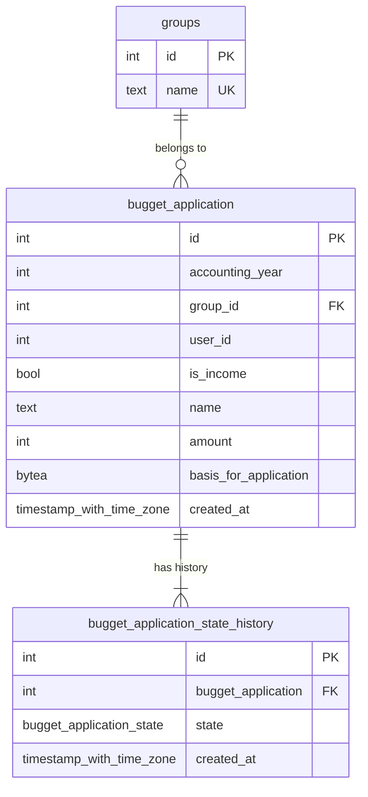

# CASる予算管理システムDBテスト

[CASる](cas-ru.com)のサークル内の予算を管理するシステムのDBの実装を試してみる。

## 環境構築

1. このレポジトリをクローン
2. `docker compose up -d`する

## ER図



- `bugget_application`：予算追加/使用の申請を保持
- `bugget_application_state_history`：申請した予算の状態(確認待ち/受諾/却下/受諾取り消し)の変更履歴を保持
  - 変更履歴の初期状態は`bugget_application`の挿入をトリガーして`bugget_application_state_history`に挿入して初期化
  - PostgreSQL固有の機能を使用

## 試しにクエリ

```sql
--

-- 予算の申請
insert into
  bugget_application (
    accounting_year,
    group_id,
    is_income,
    name,
    amount
  )
values
  (2025, 1, 'hoge', true, '2025年度予算', 300),
  (2025, 1, 'hoge', false, 'カッター', 300),
  (2025, 1, 'hoge', false, '工作用紙', 300),
  (2025, 1, 'hoge', false, '絵の具', 300),
  (2025, 1, 'hoge', false, '段ボール', 300),
  (2025, 1, 'hoge', true, '追加予算', 300),
  (2025, 1, 'hoge', false, '木材', 300),
  (2025, 1, 'hoge', false, '釘', 300);


-- 予算の使用履歴の最新版を取得
select
  bugget_application.id,
  accounting_year,
  group_id,
  is_income,
  name,
  amount,
  state
from
  bugget_application
  left join (
    select
      *
    from
      (
        select
          bugget_application,
          state,
          row_number() over (
            partition by
              bugget_application
            order by
              created_at desc
          ) as rn
        from
          bugget_application_state_history
      )
    where
      rn = 1
  ) as current_state on bugget_application.id = current_state.bugget_application;


-- 予算の使用履歴の最新版を取得（PostgreSQL固有機能使用）
select
  bugget_application.id,
  accounting_year,
  group_id,
  is_income,
  name,
  amount,
  state
from
  bugget_application
  left join (
    (
      select distinct
        on (bugget_application) bugget_application,
        state
      from
        bugget_application_state_history
      order by
        bugget_application,
        created_at desc
    )
  ) as current_state on bugget_application.id = current_state.bugget_application;


-- 状態の更新
insert into
  bugget_application_state_history (bugget_application, state)
values
  (1, 'accepted'),
  (2, 'accepted'),
  (3, 'accepted'),
  (4, 'accepted'),
  (5, 'accepted'),
  (6, 'denied'),
  (7, 'accepted'),
  (8, 'accepted');
```
